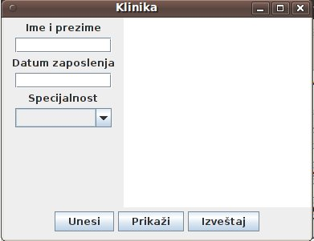
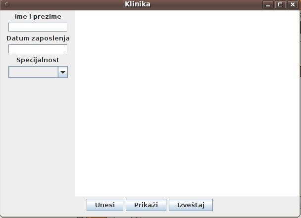

# Zadatak 2 – januar 2012

Napraviti javnu klasu **Lekar** u paketu **klinika.osoblje** koja može da se serijalizuje i ima:

* Privatni atribut **imePrezime** koji predstavlja ime i prezime lekara. Početna vrednost je “nepoznato”.
* Privatni atribut **datumZaposlenja** koji predstavlja datum zaposlenja lekara (klasa GregorianCalendar).
* Privatni atribut **specijalnost** koji predstavlja naziv specijalnosti lekara. Početna vrednost je “nepoznato”.
* Odgovarajuće javne get i set metode za ove atribute. Nedozvoljene vrednosti za ime i prezime su null i prazni Stringovi, datum mora da bude različit od null i pre trenutnog datuma, a specijalnost mora da sadrži bar tri znaka. U slučaju unosa nedozvoljenih vrednosti baciti izuzetak.
* Redefinisanu metodu **toString** koja vraća String sa svim podacima o lekaru.

Napraviti vizuelnu klasu **KlinikaGUI** u paketu **klinika** koja izgleda kao na slici levo, a kad se dimenzije promene kao na slici desno. Padajuća lista za specijalnost bi trebalo da sadrži vrednosti “opsta praksa”, “oftalmolog” i “kardiolog”. Naslov prozora je “Klinika”, a centralni deo ekrana zauzima editor.

* Klasa KlinikaGUI bi trebalo da sadrži privatni atribut **lekari** koja predstavlja listu objekata klase Lekar. Ovu listu je potrebno odmah inicijalizovati.
* Kada se pritisne dugme “Prikazi”, potrebno je u editoru ispisati podatke o lekarima iz liste __u obrnutom redosledu__ u odnosu na redosled iz liste. Podatke o svakom lekaru ispisati u posebnom redu.
* Kada se pritisne dugme “Unesi”, preuzimaju se vrednosti svih polja za unos na ekranu, pravi se novi objekat klase Lekar, puni se ovim podacima i unosi se u listu. Ako u listi već postoji lekar sa istim imenom, prezimenom i specijalnošću i datumom zaposlenja, potrebno je u editoru ispisati poruku  “Greska, taj lekar je već unet” i ne unositi ga u listu.
* Kada se pritisne dugme “Izvestaj”, potrebno je u fajl “izvestaj.out” __serijalizovati__ sve lekare iz liste koji su zaposleni u klinici kao specijalisti iz više disciplina. To su oni lekari iz liste čije ime i prezime se pojavljuje više puta u listi, ali je specijalnost drugačija. Redosled lekara u listi nije definisan

